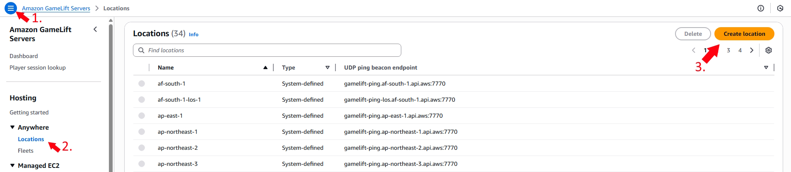
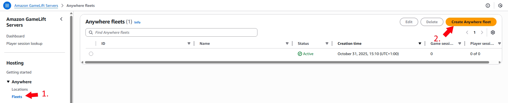
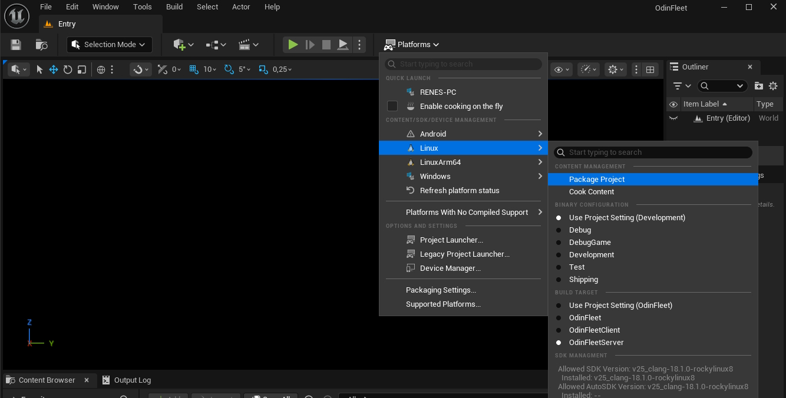
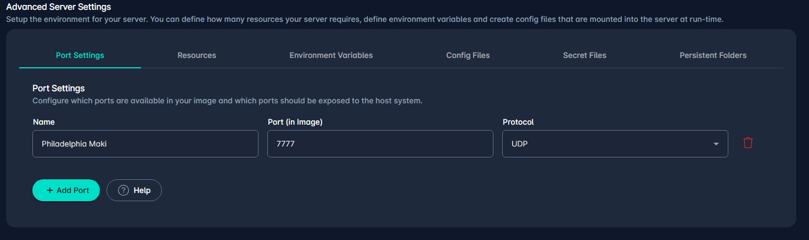
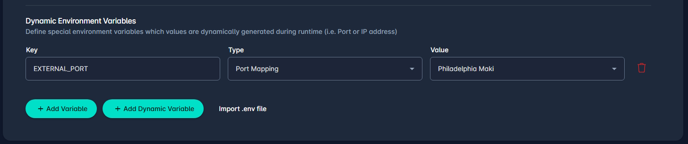
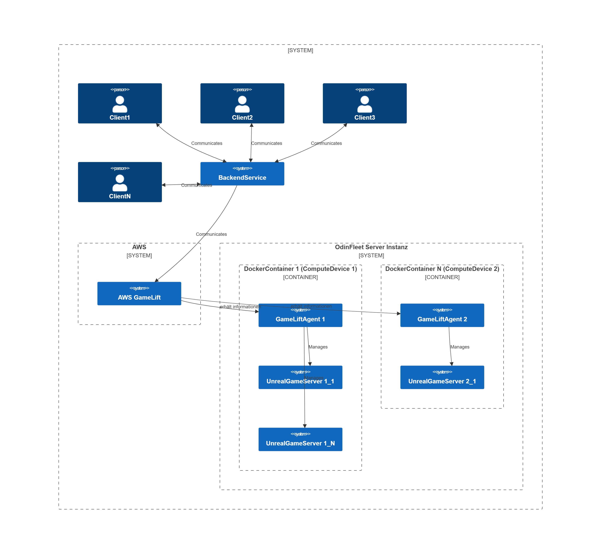

## **OdinFleet AWS Gamelift Integration**

Requirements:
* Dedicated Game Server
* GameLift Server SDK
* GameLift Server Agent

* Docker

### Dedicated Game Sercer
If you don't already have one, build an Unreal Engine Dedicated Server. A full instruction can be found [here](https://dev.epicgames.com/documentation/en-us/unreal-engine/setting-up-dedicated-servers?application_version=4.27).
The example is for 4.27 but the steps are the same in 5.6.

### GameLift Server SDK
To connect the Gameserver with Amazon Gamelift, the server needs the Gamelift Server SDK. The different versions can be found [here](https://docs.aws.amazon.com/gameliftservers/latest/developerguide/reference-serversdk.html).
We are using the [C++ SDK](https://github.com/amazon-gamelift/amazon-gamelift-plugin-unreal) for Unreal. Download and Build the SDK.

Linux or Mac:
```
chmod +x setup.sh
sh setup.sh
```
Windows
```
powershell -file setup.ps1
```

When this is done, copy the sdk to your plugins inside the Unreal Project. There are two folders you can use.
 * GameLiftServerSDK: Just contains the server SDK
 * GameLiftPlugin: Includes the Server SDK and additional UI components for the Editor.

Just copy the folder that fits your need the most.
Then add the Plugin to your PublicDependencyModules in your <projectName>.Build.cs

```

    if (Target.Type == TargetType.Server)
    {
        PublicDependencyModuleNames.Add("GameLiftServerSDK");
    }else{
        PublicDefinitions.Add("WITH_GAMELIFT=0");
    }
    bEnableExceptions =  true;
```

The next step is to initiate the SDK in the server. To do that, add to your GameMode.h following code.
```
#pragma once

#include "CoreMinimal.h"
#include "GameFramework/GameModeBase.h"
#include "YourGameMode.generated.h"

struct FProcessParameters;

DECLARE_LOG_CATEGORY_EXTERN(GameServerLog, Log, All);

UCLASS(minimalapi)
class AYourGameMode : public AGameModeBase
{
    GENERATED_BODY()

public:
    AYourGameMode();

protected:
    virtual void BeginPlay() override;

private:
    void InitiateGameLift();

private:
    TSharedPtr<FProcessParameters> ProcessParameters;
}; 
```
and implement the InitiateGameLift function in the corresponding .cpp.

Add the SDK includes and instantiate the ProcessParameters:

```
#include "YourGameMode.h"

#include "UObject/ConstructorHelpers.h"
#include "Kismet/GameplayStatics.h"

#if WITH_GAMELIFT
#include "GameLiftServerSDK.h"
#include "GameLiftServerSDKModels.h"
#endif

#include "GenericPlatform/GenericPlatformOutputDevices.h"
DEFINE_LOG_CATEGORY(GameServerLog);

AYourGameMode::AYourGameMode() : ProcessParameters(nullptr)
{
  ...//Your contructor code
}
```

Implement InitiateGameLift:

```
void AYourGameMode::InitiateGameLift()
{
    #if WITH_GAMELIFT
    UE_LOG(GameServerLog, Log, TEXT("Calling InitGameLift..."));
    FGameLiftServerSDKModule* GameLiftSdkModule = &FModuleManager::LoadModuleChecked<FGameLiftServerSDKModule>(FName("GameLiftServerSDK"));

    UE_LOG(GameServerLog, Log, TEXT("Initializing the GameLift Server..."));
    //InitSDK will establish a local connection with GameLift's agent to enable further communication.
    FGameLiftGenericOutcome InitSdkOutcome = GameLiftSdkModule->InitSDK();

        if (InitSdkOutcome.IsSuccess())
    {
        UE_LOG(GameServerLog, SetColor, TEXT("%s"), COLOR_GREEN);
        UE_LOG(GameServerLog, Log, TEXT("GameLift InitSDK succeeded!"));
        UE_LOG(GameServerLog, SetColor, TEXT("%s"), COLOR_NONE);
    }
    else
    {
        UE_LOG(GameServerLog, SetColor, TEXT("%s"), COLOR_RED);
        UE_LOG(GameServerLog, Log, TEXT("ERROR: InitSDK failed : ("));
        FGameLiftError GameLiftError = InitSdkOutcome.GetError();
        UE_LOG(GameServerLog, Log, TEXT("ERROR: %s"), *GameLiftError.m_errorMessage);
        UE_LOG(GameServerLog, SetColor, TEXT("%s"), COLOR_NONE);
        return;
    }

        ProcessParameters = MakeShared<FProcessParameters>();

    //When a game session is created, Amazon GameLift Servers sends an activation request to the game server and passes along the game session object containing game properties and other settings.
    //Here is where a game server should take action based on the game session object.
    //Once the game server is ready to receive incoming player connections, it should invoke GameLiftServerAPI.ActivateGameSession()
    ProcessParameters->OnStartGameSession.BindLambda([=](Aws::GameLift::Server::Model::GameSession InGameSession)
        {
            FString GameSessionId = FString(InGameSession.GetGameSessionId());
            UE_LOG(GameServerLog, Log, TEXT("GameSession Initializing: %s"), *GameSessionId);
            GameLiftSdkModule->ActivateGameSession();
        });

    //OnProcessTerminate callback. Amazon GameLift Servers will invoke this callback before shutting down an instance hosting this game server.
    //It gives this game server a chance to save its state, communicate with services, etc., before being shut down.
    //In this case, we simply tell Amazon GameLift Servers we are indeed going to shutdown.
    ProcessParameters->OnTerminate.BindLambda([=]()
	{
		UE_LOG(GameServerLog, Log, TEXT("Game Server Process is terminating"));
		FGameLiftGenericOutcome processEndingOutcome = GameLiftServerSdkModule->ProcessEnding();

		FGameLiftGenericOutcome destroyOutcome = GameLiftServerSdkModule->Destroy();
		if (processEndingOutcome.IsSuccess() && destroyOutcome.IsSuccess())
		{
			UE_LOG(GameServerLog, Log, TEXT("Server process ending successfully"));
			FGenericPlatformMisc::RequestExit(false); //Important, otherwise it could remain an process open, that blocks the used port
		}else{
			if (!processEndingOutcome.IsSuccess()) {
				const FGameLiftError& error = processEndingOutcome.GetError();
				UE_LOG(GameServerLog, Error, TEXT("ProcessEnding() failed. Error: %s"),
				error.m_errorMessage.IsEmpty() ? TEXT("Unknown error") : *error.m_errorMessage);
			}
			if (!destroyOutcome.IsSuccess()) {
				const FGameLiftError& error = destroyOutcome.GetError();
				UE_LOG(GameServerLog, Error, TEXT("Destroy() failed. Error: %s"),
				error.m_errorMessage.IsEmpty() ? TEXT("Unknown error") : *error.m_errorMessage);
			}
		}
	});
        //This is the HealthCheck callback.
    //Amazon GameLift Servers will invoke this callback every 60 seconds or so.
    //Here, a game server might want to check the health of dependencies and such.
    //Simply return true if healthy, false otherwise.
    //The game server has 60 seconds to respond with its health status. Amazon GameLift Servers will default to 'false' if the game server doesn't respond in time.
    //In this case, we're always healthy!
    ProcessParameters->OnHealthCheck.BindLambda([]()
        {
            UE_LOG(GameServerLog, Log, TEXT("Performing Health Check"));
            return true;
        });

    //GameServer.exe -port=7777 LOG=server.mylog
    ProcessParameters->port = FURL::UrlConfig.DefaultPort;
    TArray<FString> CommandLineTokens;
    TArray<FString> CommandLineSwitches;

    FCommandLine::Parse(FCommandLine::Get(), CommandLineTokens, CommandLineSwitches);

    for (FString SwitchStr : CommandLineSwitches)
    {
        FString Key;
        FString Value;

        if (SwitchStr.Split("=", &Key, &Value))
        {
            if (Key.Equals("port"))
            {
                ProcessParameters->port = FCString::Atoi(*Value);
            }
        }
    }
    //Here, the game server tells Amazon GameLift Servers where to find game session log files.
    //At the end of a game session, Amazon GameLift Servers uploads everything in the specified 
    //location and stores it in the cloud for access later.
    TArray<FString> Logfiles;
    Logfiles.Add(TEXT("GameLiftUnrealApp/Saved/Logs/server.log"));
    ProcessParameters->logParameters = Logfiles;

    //The game server calls ProcessReady() to tell Amazon GameLift Servers it's ready to host game sessions.
    UE_LOG(GameServerLog, Log, TEXT("Calling Process Ready..."));
    FGameLiftGenericOutcome ProcessReadyOutcome = GameLiftSdkModule->ProcessReady(*ProcessParameters);

    if (ProcessReadyOutcome.IsSuccess())
    {
        UE_LOG(GameServerLog, SetColor, TEXT("%s"), COLOR_GREEN);
        UE_LOG(GameServerLog, Log, TEXT("Process Ready!"));
        UE_LOG(GameServerLog, SetColor, TEXT("%s"), COLOR_NONE);
    }
    else
    {
        UE_LOG(GameServerLog, SetColor, TEXT("%s"), COLOR_RED);
        UE_LOG(GameServerLog, Log, TEXT("ERROR: Process Ready Failed!"));
        FGameLiftError ProcessReadyError = ProcessReadyOutcome.GetError();
        UE_LOG(GameServerLog, Log, TEXT("ERROR: %s"), *ProcessReadyError.m_errorMessage);
        UE_LOG(GameServerLog, SetColor, TEXT("%s"), COLOR_NONE);
    }

    UE_LOG(GameServerLog, Log, TEXT("InitGameLift completed!"));
    #endif
}
```

And call it in BeginPlay
```
void AOdinFleetGameMode::BeginPlay()
{
	Super::BeginPlay();

#if WITH_GAMELIFT
	InitGameLift();
	#endif
}
```

You dont need to initalize and set any parameter used for AnywhereFleets. These get handled by the GameLift Server Agent.
If your're interested in doing that manually, there is a guide inside the README.md in the plugin folder.

The minimum the GameServer has to do is:
* Call InitSDK()
* Implement GameSessionCallbacks (OnStartGameSession,OnTerminate,OnHealthCheck)
* Set the used port.
* Call ProcessReady()


### GameLift Server Agent
The Server Agent handles all neccessary steps to work with GameLift
 * Takes AccessKey of your AWS Account
 * Registers a compute device
 * Reads and refreshes the auth-token for the compute device
 * Starts the Gameserver with set parameters
 * Manages the hearbeat


#### AWS Account and Userpermissions
At first create an AWS Account. With that account, go to Identity and Access Management(IAM) and create a new user. Select this new user and create an Access key for it. Go to Security credentials -> Create access key and store it savely.

The user needs a few permission for the tasks done by the agent.
For following tasks, the user needs permissions:
* Register Compute
* GetComputeAuthToken
* DeregisterCompute

The cleanest way is to create a new policy, give it a name and add it to the user.
In the AWS Console navigate to IAM->Policies and create a new policy.
Select the persmission in the visual editor or switch from Visual to JSON and insert them:
```
{
	"Version": "2012-10-17",
	"Statement": [
		{
			"Sid": "AllowRegisterComputeOnFleet",
			"Effect": "Allow",
			"Action": "gamelift:RegisterCompute",
			"Resource": "arn:aws:gamelift:<your-region>:<your-account-id>:fleet/<your-fleet-id>"
		},
		{
			"Sid": "DeregisterCompute",
			"Effect": "Allow",
			"Action": "gamelift:DeregisterCompute",
			"Resource": "arn:aws:gamelift:<your-region>:<your-account-id>:fleet/<your-fleet-id>"
		},
		{
			"Sid": "GetAuthTokenForFleet",
			"Effect": "Allow",
			"Action": "gamelift:GetComputeAuthToken",
			"Resource": "arn:aws:gamelift:<your-region>:<your-account-id>:fleet/<your-fleet-id>"
		},
	]
}
```
Click Next->Save Changes and go back to the user. Add the created policy and the user is ready to be used by the agent.

#### Gamelift Location and Fleet
Navigate to [Amazon Gamlift Servers](https://eu-central-1.console.aws.amazon.com/gameliftservers/dashboard) and create a custom Location for your AnywhereFleet.


Then create an AnywhereFleet


Give it an name and select your custom location.

 
#### Initiate the Agent
Download the agent from the [Github page](https://github.com/amazon-gamelift/amazon-gamelift-agent).

To build the agent you need at least java 17 and maven 3.2.5
You can check both versions with:
```
Java:
java -version

Maven:
mvn -version
```

If missing or having a lower version, you can donwload them:
* [Java](https://www.oracle.com/java/technologies/javase/jdk17-archive-downloads.html)
* [Maven](https://maven.apache.org/download.cgi)

When both match the minimum version, open a new terminal/cmd in the root of the agent(where the pom.xml is located) and build the Agent
```
mvn clean compile assembly:single
```
If it is successfull, the .jar file is located at
```
./target/GameLiftAgent-1.0.jar
```

That .jar file will be the entrypoint of the Docker image which is created later.


The agent needs to know where the server executable is located. This information is provided by a runtime-config.json.
This is structured as followed:
 ```
 {
  "ServerProcesses": [
    {
      "LaunchPath": "/local/game/<server-executable>",
      "Parameters": "server parameter",
      "ConcurrentExecutions": 1
    }
  ],
  "MaxConcurrentGameSessionActivations": 1,
  "GameSessionActivationTimeoutSeconds": 300
}
 ```
On Windows the LaunchPath has to start witch 
`C:/Game/`,
on Linux with `/local/game/`.

If you need a full documentation, check [this](https://docs.aws.amazon.com/gameliftservers/latest/apireference/API_RuntimeConfiguration.html).

### Docker
OdinFleet is using dockerimages to install the Gameserver. Install [Docker](https://docs.docker.com/desktop/setup/install/windows-install/), create an account and enabel Windows Subsystem for Linux.
This is done in a command prompt by:

`wsl --install`

#### Unreal Server Build
 For that image you are creating you need a Linux build of the GameServer. To do that you need to install the Linux Cross-Compile chain. There is an [Unreal Guide](https://dev.epicgames.com/documentation/en-us/unreal-engine/linux-development-requirements-for-unreal-engine?application_version=5.0) with referenced versions. Download the corredt one and install it. You can verify the installation in a terminal with:

`echo %LINUX_MULTIARCH_ROOT%` 
Now build the server-executable.

Open the Editor and Package the Server.



You can also package the server with the command prompt.
```
<path-to-source-built-engine>/Engine/Build/BatchFiles/RunUAT.bat BuildCookRun ^
 -project="<path-to-your-project>/<YourProject>.uproject" ^
 -noP4 -server -platform=Linux -clientconfig=Shipping -serverconfig=Shipping ^
 -cook -allmaps -build -stage -pak -archive ^
 -archivedirectory="<Your-package-folder>"
```
#### Prepare Dockerimage
Now Create a folder (for example DockerImageData) with all needed files. You need:
```
DockerImageData
-<Your-package-folder>
-GameLiftAgent-1.0.jar
-runtime-config.json
```
Inside DockerImageData create a Dockerfile. The dockerfile copies the required files into the dockerimage and sets the entrypoint. The entrypoint is the script or executable which is called when the dockercontainer gets started.

Dockerfile:
```
FROM ghcr.io/epicgames/unreal-engine:runtime

USER root

# install java to run the agent.jar this need root user permissions
RUN apt-get update && apt-get install -y --no-install-recommends openjdk-17-jre-headless \
 && rm -rf /var/lib/apt/lists/*
# switch to ue4 user. Some executions cant be made as root
USER ue4
# Put game under /local/game and make ue4 the owner
WORKDIR /local/game
COPY --chown=ue4:ue4 LinuxServer/ /local/game/

# copy Agent and entrypoint; also owned by ue4
COPY --chown=ue4:ue4 GameLiftAgent-1.0.jar /gamelift/agent.jar
COPY --chown=ue4:ue4 entrypoint.sh /entrypoint.sh

# create log folders and set permissions for user ue4
RUN chmod 0755 /entrypoint.sh \
 && mkdir -p /local/game/Saved/Logs /local/game/logs /local/gameliftagent \
 && chown -R ue4:ue4 /local /gamelift


ENTRYPOINT ["/entrypoint.sh"]
```

We are using a script as entrypoint to start the agent and pass required parameters.
Create a file entrypoint.sh inside DockerImageData.

entrypoint.sh:
```
#!/usr/bin/env bash
set -euo pipefail

# If COMPUTE_NAME isn't provided, generate one
if [[ -z "${COMPUTE_NAME:-}" || "${COMPUTE_NAME}" == "auto" ]]; then
  # /proc/sys/kernel/random/uuid exists by default and doesn't need uuidgen
  RAND_ID="$(cat /proc/sys/kernel/random/uuid)"
  # Optional: prefix to recognize the node in AWS console
  COMPUTE_NAME="odin-$(echo "$RAND_ID" | tr '[:upper:]' '[:lower:]')"
fi
: "${REGION:?Set REGION}"
export AWS_REGION="${AWS_REGION:-$REGION}"
: "${FLEET_ID:?Set FLEET_ID}"
: "${LOCATION:?Set LOCATION}"
: "${REGION:?Set REGION}"
: "${PUBLIC_IP:?Set PUBLIC_IP}"

exec java -jar /gamelift/agent.jar -c "${COMPUTE_NAME}" -f "${FLEET_ID}" -loc "${LOCATION}" -r "${REGION}" -ip-address "${PUBLIC_IP}"
```

This script reads the enviromnent variables and passes them to the agent.
The compute name is generated. When the agent is closed, the registered compute remains in the state TERMINATING for about 1-3 days until AWS sets it back to ACTIVE. When you try to register an existing Compute-name that is in TERMINATING, the register fails and the agent cannot succesfull connect to an AWS compute-device.

#### Runtime-config

You can either upload the config to AWS or copy it to the image and set the path to the agent.jar call

Upload it with the [AWS-CLI](https://docs.aws.amazon.com/cli/latest/userguide/getting-started-install.html):

`aws gamelift update-runtime-configuration --<your-fleet-oid> --runtime-configuration file://<path-to-config>/runtime-config.json --region <your-region>`,

and the agent loads it automatically.

If you want to add it manually, add -runtime-configuration or -rc as parameter to the `exec java -jar /gamelift/agent.jar` call and pass the config as inline JSON.

The Unreal LinuxBuild contains an GameServer.sh in its root. This script calls the server executable which is located in `\LinuxServer\<your-project-name>\Binaries\Linux`.
We use that .sh scrip as LaunchPath in the runtime-config. 
Inside that script we can pass the external port of the OdinFleet server. This is needed because the gameserver cant use the unreal-defaultport 7777. It needs to listen to the external port of the Hardwareserver.

An example to pass the port inside the server.sh:
```
#!/bin/sh
UE_TRUE_SCRIPT_NAME=$(echo \"$0\" | xargs readlink -f)
UE_PROJECT_ROOT=$(dirname "$UE_TRUE_SCRIPT_NAME")
chmod +x "$UE_PROJECT_ROOT/<your-project-name>/Binaries/Linux/<your-project-executable>"

PORT_ARG=""
if [ -n "${EXTERNAL_PORT:-}" ]; then
  PORT_ARG="-port=${EXTERNAL_PORT}"
fi

"$UE_PROJECT_ROOT/<your-project-name>/Binaries/Linux/<your-project-executable>" <your-project-name> "$@" $PORT_ARG
```
**Keep in mind that this file will be overridden if your repackage your project!**

Now you can to build the dockerimage. Open a command prompt in the directory where the Dockerfile is located and call:
#### Build Dockerimage
`docker build -t <your-image-name>:<your-image-tag> .`

You can now test that image local inside Docker Desktop. Go to image, locate your server image and click run. Now you need to pass the envirnment variables and set the port.
These variables are required if you followed the examples:
* FLEET-ID
* LOCATION
* REGION
* PUBLIC_IP (Ip-address of the odinfleet server)
* EXTERNAL_PORT

These are used by the Agent internally:
* AWS_ACCESS_KEY_ID
* AWS_SECRET_ACCESS_KEY

If everything works local you can tag and push this image to dockerhub.

```
docker tag <your-image-name>:<image-tag> <docker-username>/<your-image-name>:<release-tag>  
# release tag can be a version or something like latest/release etc.

docker push <docker-username>/<your-image-name>:<release-tag>

```

### OdinFleet
The final step is to load the image on an OdinFleet server.
You can follow the guide steps for creating a Fleet App ([Minecraft-server example](https://docs.4players.io/fleet/guides/getting-started/) or [Unreal game server example](https://docs.4players.io/fleet/guides/unreal-server/))

#### Server Config

Create a port in the Port Settings as mentioned in the referenced guides


Now add a Dynamic Variable to the Environment Variables


This uses the server port as variable EXTERNAL_PORT which is used in server and is transmitted to Gamelift.

This also adds a portmapping. The dockerimage gets this port as image port.
````
ServerPort: 12345
Image uses 12345 as Imageport
Mapping:
12345->12345
````


### Backend Service

To avoid storing AWS AccesKey inside the client, the client itself cannot communicate with AWS to retrieve GameSessions. This communication should be done with a BackendService. Usually this is some kind of a REST-API.

The client communicates with this API which uses AWS AccesKeys in a secure environment. 
To build this API you need the [AWS Gamelifft client sdk](https://docs.aws.amazon.com/AWSJavaScriptSDK/v3/latest/Package/-aws-sdk-client-gamelift/).

Install it  
NPM: `npm install @aws-sdk/client-gamelift`

Yarn: `yarn add @aws-sdk/client-gamelift`

pnpm: `pnpm add @aws-sdk/client-gamelift`

You can use any kind of Node.js/web-service of your choice. In this example we are using GoogleCloud Run functions. We are not going deep into the initialization of an GoogleCloud project, just know these act the same as any other https endpoint.
The base scheme of the client-sdk is following:
* Create an iput object
* Create the required command
* Pass the input object
* Execute the command

First include the sdk,set some variables and create a GameliftClient:
```
const {onRequest} = require("firebase-functions/v2/https");
const {GameLiftClient, SearchGameSessionsCommand, CreateGameSessionCommand, TerminateGameSessionCommand} = require('@aws-sdk/client-gamelift');

const FleetID = "<your-fleet-id>";
const Location = "your-location";
const AWSRegion = "your-aws-region";//example: eu-central-1
const GCloudRegion = "your-gcloud-region";//example: europe-west3
// Create and deploy your first functions
// https://firebase.google.com/docs/functions/get-started

// exports.helloWorld = onRequest((request, response) => {
//   logger.info("Hello logs!", {structuredData: true});
//   response.send("Hello from Firebase!");
// });


//Create the GameliftClient
const gameLiftClient = new GameLiftClient({
    region:"eu-central-1",
    credentials:{
        accessKeyId:"",
        secretAccessKey:""
    }
});
```

Note: You can and should store your AWS Credentials in a credential-file, environment-variable or an secure-storage.

Now you can add the needed commandcalls.  
Example [Search for Gamesessions](https://docs.aws.amazon.com/AWSJavaScriptSDK/v3/latest/Package/-aws-sdk-client-gamelift/Class/SearchGameSessionsCommand/):
```
exports.<your-function-name> = onRequest({region:GCloudRegion},async(req,res)=>{

    const SearchInput = {
        FleetId:FleetID,
        Location:Location,
    };
    const command = new SearchGameSessionsCommand(SearchInput);
    await executeCommand(res,command);
    return;
});

async function executeCommand(res,command){
    try {
        const response = await gameLiftClient.send(command);
        res.status(200).send(response); 
        return;
    } catch (error) {
        console.error(error);
        res.status(400).send(error);
        throw error;
    }
}


```

Example [Create GameSession](https://docs.aws.amazon.com/AWSJavaScriptSDK/v3/latest/Package/-aws-sdk-client-gamelift/Class/CreateGameSessionCommand/):
```
exports.<your-function-name> = onRequest({region:GCloudRegion},async (req,res)=>{
    if(req.body.CreatorId === undefined){
        res.status(401).send("Missing CreatorId");
        return;
    }
    if(req.body.SessionName === undefined){
        res.status(401).send("Missing SessionName");
        return;
    }

    const input = {
        FleetId: FleetID,
        Location:Location,
        CreatorId:req.body.CreatorId,
        Name:req.body.SessionName,
        MaximumPlayerSessionCount:Number(2),
    };
    const command = new CreateGameSessionCommand(input);
    await executeCommand(res,command);
    return;
});
```
Example [Terminate GameSession](https://docs.aws.amazon.com/AWSJavaScriptSDK/v3/latest/Package/-aws-sdk-client-gamelift/Class/TerminateGameSessionCommand/):
```
exports.<your-function-name> = onRequest({region:GCloudRegion},async (req, res) =>{

    if(req.body.GameSessionId === undefined){
        res.status(401).send("Missing GameSessionId");
        return;
    }

    const input = { // TerminateGameSessionInput
        GameSessionId: req.body.GameSessionId, // required
        TerminationMode: "TRIGGER_ON_PROCESS_TERMINATE", // required
    };
    const command = new TerminateGameSessionCommand(input);
    await executeCommand(res,command);
});
```
Note: These examples don't handle any sercurity or authorization. To secure your service against unwanted or unauthorized calls you need to use your own security layer!

### Unreal Game Client
Now you need to connect the GameClient with your Backendservice. We are doing this with an c++ httpRequest:

```
void UGLBSServiceConnector::GetSessions(FSearchComplete OnReady)
{	
	TFunction<void(const FJsonObject& Result, const FString& Error)> Done;
	FHttpModule& Module= FHttpModule::Get();
	TSharedRef<IHttpRequest, ESPMode::ThreadSafe> Request = Module.CreateRequest();

	Request->SetURL("https://<your-region>-<your-gcloud-projectname>.cloudfunctions.net/<your-function-name>");
	Request->SetVerb("GET");
	Request->SetHeader("Content-Type", "application/json");

	Request->OnProcessRequestComplete().BindLambda([OnReady](FHttpRequestPtr, FHttpResponsePtr Response,bool bOK)
	{
		const FString ResponseString = Response->GetContentAsString();
		TSharedRef<TJsonReader<>> Reader = TJsonReaderFactory<>::Create(ResponseString);
		TSharedPtr<FJsonObject> Json;
		if (!FJsonSerializer::Deserialize(Reader,Json) || !Json.IsValid())
		{
			TArray<FGameSessionData> GameSessions;
			FGameSessionData data;
			GameSessions.Add(data);
			OnReady.Execute(GameSessions);
			return;
		}
		if (Json->HasField(FString(TEXT("GameSessions"))))
		{
			TArray<FGameSessionData> GameSessionsStruct;
			FGameSessionData data;
			TArray<TSharedPtr<FJsonValue>> GameSessionsJson = Json->GetArrayField(FString(TEXT("GameSessions")));
			for (TSharedPtr<FJsonValue> GameSession : GameSessionsJson)
			{
                //Create a struct or Object from the json result
				data = CreateGameSessionFromJson(GameSession);
				GameSessionsStruct.Add(data);
			}			
			OnReady.Execute(GameSessionsStruct);
			return;
		}
		TArray<FGameSessionData> GameSessions;
		FGameSessionData data;
		GameSessions.Add(data);
		OnReady.Execute(GameSessions);

	});

	Request->ProcessRequest();
}
```


### Communication ways

The following chart shows the Gamelift communication. Game communication between server and client is excluded.



